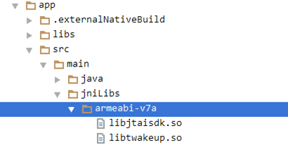
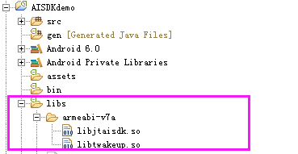
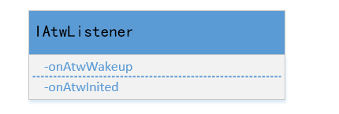
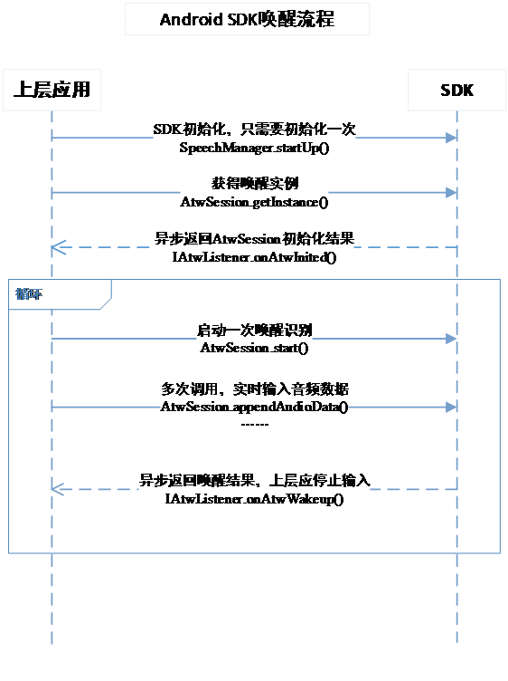
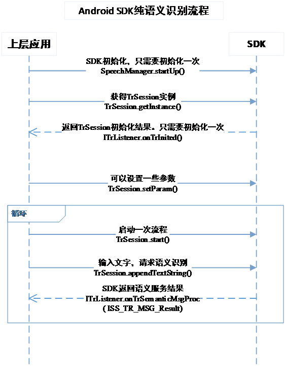
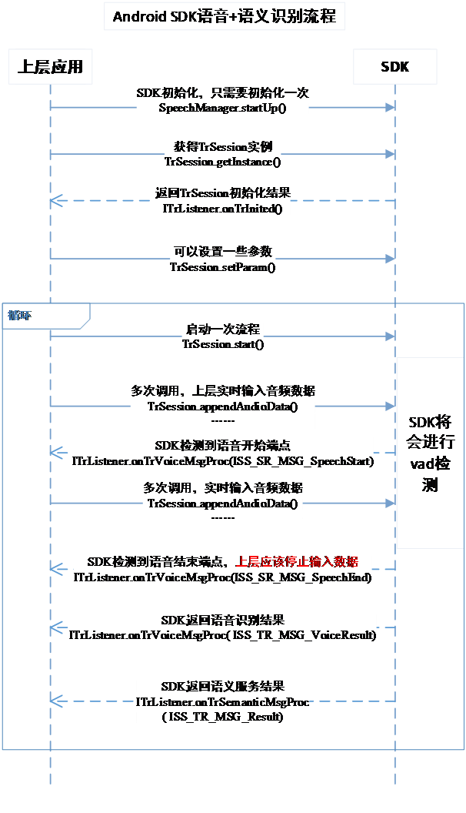
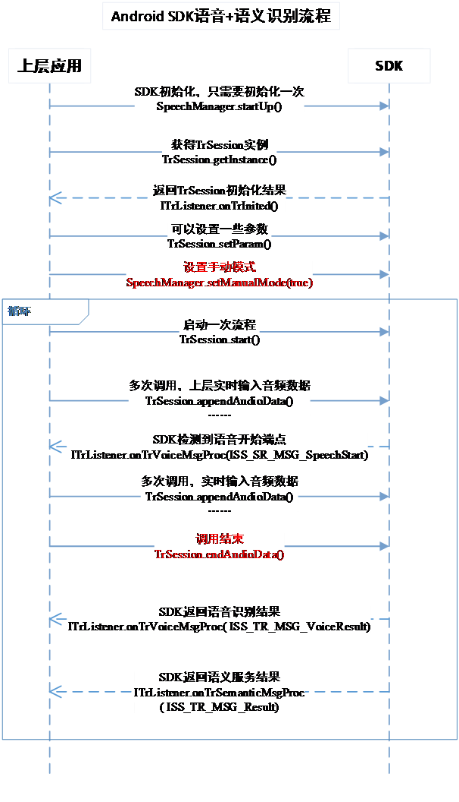
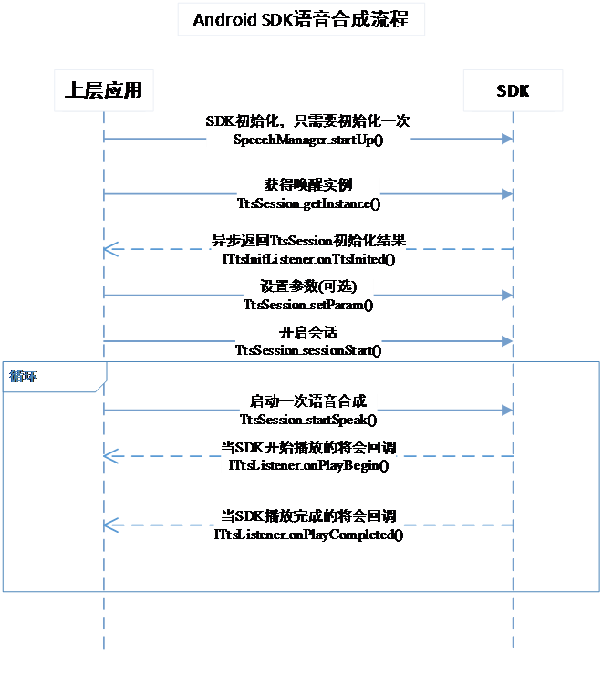

# TVS Device SDK Android版本接入说明 #
## 开发指南 ##
### 一、简介 ###
#### 1.1、名词解释 ####

　　TVS DEVICE SDK：提供腾讯语音唤醒、语音识别、语音合成、语义理解、语义服务技术解决方案的软件开发工具包。</br>
　　语音唤醒：智能硬件/应用在休眠状态下通过个性化语音唤醒词被唤醒。</br>
　　语音识别：将语音转变为对应的语句文本。</br>
　　语义理解：将语句文本转变成结构化的实体、领域、意图、服务数据。</br>
　　语音合成：将语句文本转变为流利的语音。</br>

### 二、入门 ###
#### 2.1、SDK使用步骤 ####
##### 2.1.1、复制库 #####
1、so库
首先，需要把SDK zip包内的so库放置在项目libs目录下：
如果是Android Studio开发的项目，放置在jniLibs/armeabi-v7a下面（放置的位置与你项目设置有关，总而言之，把so放到应用里）
如：</br>
</br></br>
如果是eclipse开发的项目，放置在libs/armeabi-v7a下：</br>
</br></br>

2.、jar包	
TVSDeviceSDK.jar包放置在项目的libs下面即可。</br></br>
##### 2.1.2、增加权限 #####
在AndroidManifest.xml中增加以下权限：</br>
```xml
<uses-permission android:name="android.permission.RECORD_AUDIO" />
```
###### 用于读取手机当前的状态 ######
```xml
<uses-permission android:name="android.permission.READ_PHONE_STATE" />
```
###### 写入扩展存储，向扩展卡写入数据，用于写入离线定位数据 ######
```xml
<uses-permission android:name="android.permission.WRITE_EXTERNAL_STORAGE" />
```
###### 访问网络，网络定位需要上网 ######
```xml
<uses-permission android:name="android.permission.INTERNET" />
```
###### 获取运营商信息，用于支持提供运营商信息相关的接口 ######
```xml
<uses-permission android:name="android.permission.ACCESS_NETWORK_STATE" />
```
##### 2.1.3、SDK初始化 #####
使用SDK任何接口前，必须完成SDK初始化。</br>
SDK初始化需要调用com.tencent.ai.sdk.control.SpeechManager的一系列方法。</br>
初始化代码如下：</br></br>
//初始化函数，接口有变动，新增**LoadingCallback**回调初始化是否成功</br>
<pre><code>SpeechManager.getInstance().startUp(Context context, String info,LoadingCallback loadingCallback);</code></pre>
info是JSON格式数据，其格式如下：
新增**deviceSerialNum**必填项，标识设备唯一ID
<pre><code>{
	"info": {
	"appkey": "填入应用的appkey",
	"token": "填入应用的access token",
	"deviceName": "固定，填入CAR或者TV或者SPEAKER或者PHONE",
	"productName":"产品名称，不要空格",
	"deviceSerialNum": "设备唯一标识码，唯一设备ID", 
	"vendor": "厂商英文名"
	}
}</code></pre>

对于deviceName的指定，按照如下原则：

| 产品类型       | deviceName          
| ------------- |:-------------:
| 车机类         | CAR
| 电视类         | TV     
| 音箱类         | SPEAKER   
| 手机app类      | PHONE    

其他注意的方法：</br>
//设置当前位置坐标，不仅当初始化的设置，当用户位置变化的时候，也需要设置。
<pre><code>SpeechManager.getInstance().setCurrentLocation(Location location)</code></pre>
//设置是否手动控制语音识别流程</br>
<pre><code>SpeechManager.getInstance().setManualMode(true);</code></pre>
//设置显示SDK log，方便定位问题</br>
<pre><code>SpeechManager.getInstance().setDisplayLog(true);</code></pre>
//设置静音超时时长，单位ms</br>
<pre><code>SpeechManager.getInstance().setSilenceTimeout(int silTimeout);</code></pre>
//设置静音结束时长，单位ms</br>
<pre><code>SpeechManager.getInstance().setSilenceTime(int silTime);</code></pre>
//设置偏向领域接口</br>
<pre><code>SpeechManager.getInstance().setAsrDomain(int asrDomain);</code></pre>
//设置SDK各项参数，key存放在settings包下，CommonConfig（通用设置）VoiceConfig（语音识别设置）WakeupConfig（唤醒设置）以AISDK_CONFIG_开头的，value是AISDK_CONFIG_VALUE_开头
<pre><code>SpeechManager.getInstance().aisdkSetConfig(int key, String value)</code></pre>

#### 2.2、输入音频要求 ####
　　SDK的唤醒识别和在线语音识别对输入音频的要求是一致的，要求如下表所示：

| 项目      | 要求        
| --------- |:-------------:
| 音频格式         | PCM格式
| 采样精度         | 16位     
| 采样率         | 16000Hz   
| 声道      | 小端 

#### 2.3、语音唤醒 ####
##### 2.3.1、功能 #####
唤醒的接口，可以识别音频流中的唤醒词。上层可以根据识别结果进行进一步的操作。</br></br>
　　SDK不能进行录音，所以需要上层把录音的数据实时传过来。对输入语音格式要求：16K采样率、S16-LE、单声道的PCM录音。</br>
　　功能由AtwSession类提供。

##### 2.3.2、回调 #####
　　上层应用可以注册IAtwListener对象接收唤醒的异步回调，初始化的返回和唤醒结果都是通过该对象回调回来。其类成员为：</br>
　　注意：初始化成功后才能进行其他操作。</br>
</br></br>
##### 2.3.3、交互流程 #####
注意：初始化的时候需要传入resource/tsr（语音识别模型）的路径。</br></br>
</br></br>

#### 2.4、语音语义识别 ####
##### 2.4.1、功能 #####
　　语音识别的接口，可以识别音频流中的文字，并返回到上层，方式为流式识别（例如用户还在说话中，就返回一部分文本）。语义的接口，可以将文本识别为的domain和intent、语义实体，并返回对应的服务数据。例如把“我想听周杰伦的歌曲”识别为domain为music、intent为play，带有的语义实体是歌手名字为“周杰伦”，服务数据为周杰伦的歌曲列表。语音/语义的功能都由TrSession提供。</br>
　　	SDK不能进行录音，所以需要上层把录音的数据实时传过来。对输入语音格式要求：16K采样率、S16-LE、单声道的PCM录音。</br></br>
　　TrSession返回的语义结果为JSON格式，具体请参考《SDK语义格式》
语音识别支持自动模式和手动模式。自动模式下， SDK自动检测语音结束，并返回语音识别结果。手动模式下，上层控制语音的结束。</br>
##### 2.4.2、回调 #####
　　上层应用可以注册com.tencent.ai.sdk.tr.ITrListener对象接收语音语义识别的异步回调，初始化的返回和结果都是通过该对象回调回来。</br>
　　注意：初始化成功后才能进行其他操作。</br>
##### 2.4.3、参数设置 #####
　　<pre><code>　　/**TrSession.setParam可以设置语义语音识别的参数。
　　  *
　　  * 设置TRSession工作模式
　　  * param: TrSession.ISS_TR_PARAM_VOICE_TYPE
　　  * 值范围：
　　  * TrSession.ISS_TR_PARAM_VOICE_TYPE_RSP_VOICE：仅返回语音识别结果。
　　  * TrSession.ISS_TR_PARAM_VOICE_TYPE_RSP_ALL：语音+语义识别
　　  */</br></br>TrSession.setParam(String szParam, String szParamValue); //可以设置语义语音识别的参数。</code></pre>
</br>
如果只需要语义识别，请调用appendTextString方法</br>
##### 2.4.4、参数设置 #####
###### 2.4.4.1、纯语义识别的流程 ######
</br></br>
###### 2.4.4.2、语音+语义识别的流程（自动模式，默认） ######
</br></br>
###### 2.4.4.3、语音+语义识别的流程（手动模式） ######
SDK默认情况下采用自动模式，如果开发者需要自己控制语音的结束，调用SpeechManager.getInstance().setManualMode(true);将语音识别设置为手动模式。并且结束语音时，调用endAudioData()。
</br></br>

##### 2.4.5、离线识别接入 #####
离线语音识别请求：</br>
<pre><code>/**
     * @param iMode TrSession.ISS_TR_MODE_CLOUD_REC 在线识别；TrSession.ISS_TR_MODE_LOCAL_REC 离线识别;ISS_TR_MODE_MIX_REC 在线离线混合识别
     * @param record 是否使用SDK录音功能
     * @return
     */
    TrSession.start(int iMode, boolean record)</code></pre>

离线语义识别请求：</br>
<pre><code>/**
     * @param iMode TrSession.ISS_TR_MODE_CLOUD_REC 在线识别；TrSession.ISS_TR_MODE_LOCAL_REC 离线识别;ISS_TR_MODE_MIX_REC 在线离线混合识别
     * @param text 识别文本
     * @param extraMsg 自定义参数，客户端传入，返回时，SDK会将此对象返回
     * @return
     */
    TrSession.appendTextString(int iMode, String text, Object extraMsg)</code></pre>
#### 2.5、语音合成 ####
##### 2.5.1、功能 #####
　　语音合成的接口，可以将传入的文本，转换对应为音频数据。上层可以使用返回的音频数据进行播放，也可以用使用SDK的自动播报（默认自动播报）。</br>
　　返回的音频数据为单声道,采样率为16000,位深度为16bit的pcm数据，对于长文本，可能分多次返回音频数据。</br>
##### 2.5.2、回调 #####
　　上层应用可以注册com.tencent.ai.sdk.tts.ITtsInitListener对象接收初始化的异步回调。注册com.tencent.ai.sdk.tts.ITtsListener对象接收播报状态的异步回调。</br>
注意：初始化成功后才能进行其他操作。
##### 2.5.3、参数设置 #####
　　setParam可以设置语音合成的参数。</br>
　　设置是否自动播报:</br>
　　param: TtsSession. TYPE_TTS_PLAYING</br>
　　值范围：</br>
　　TtsSession. TTS_NO_PLAYING：不自动播报</br>
　　TtsSession. TTS_PLAYING：自动播报，默认</br>
##### 2.5.4、交互流程 #####
</br></br>

#### 2.6、OneShot语音识别 ####
##### 2.6.1、功能 #####
OneShot指的是用户可以把唤醒词和命令词连起来说，比如“叮当叮当，今天天气怎么样”，用前面提到的【离线语音唤醒】和【在线语音识别】接口也可以实现OneShot的效果，但是要求接入方在唤醒后把紧接着的音频输入到在线语音识别接口，如果输入的音频不连续，会影响到OneShot的效果。

本节介绍的OneShot接口的优点是，只需要一套接口，启动OneShot流程后SDK就会自动在唤醒识别和语音识别两个状态之间切换，接入方只需要一直输入音频，SDK内部保证在唤醒后把后续输入的音频发给服务端识别，从而实现OneShot的效果，得到识别结果后会自动再切换到唤醒识别，接入方不需要反复重启OneShot。

使用OneShot接口可以完全替代【离线语音唤醒】和【在线语音识别】接口，两套接口不可以同时使用。
##### 2.6.2、回调 #####
　　上层应用可以设置com.tencent.ai.sdk.tr.OneShotListeners对象，包含离线语音唤醒回调和语音语义识别及语音合成的异步回调，初始化的返回和结果都是通过该对象回调回来</br>
注意：初始化成功后才能进行其他操作。
##### 2.6.3、交互流程 #####
主要流程：
- 调用OneShotSession构造函数初始化OneShot，需要传入TrParameters对象，需要调用setWakeupResDir设置唤醒模型路径（必传，否则无法唤醒）和setOnlineVoiceResDir设置vad模型（可不传）。
- 调用start启动OneShot语音识别。
- 调用appendAudioData输入音频。
- 处理SDK的回调，包括唤醒识别的回调和语音识别的回调，回调的命令跟【离线语音唤醒】和【在线语音识别】一致。
- 如果要停止OneShot，调用release停止整个流程。如果还想继续识别唤醒和语音，不需要调用这个接口，继续输入音频即可。

其他流程：
- 如果需要手动唤醒，调用startOnlineVoice2Text启动一次在线语音识别
- 如果要取消进行中的在线语音识别，调用cancelOnlineVoice2Text。
- 如果要手动停止进行中的在线语音识别并获取识别结果，调用stopOnlineVoice2Text。

#### 2.7、自定义唤醒 ####
##### 2.7.1、功能 #####

用户可以将汉字词组设置为唤醒词，可以识别音频流中的用户设置的唤醒词。上层可以根据识别结果进行进一步的操作。功能由TvwSession提供

##### 2.7.2、回调 #####

  上层应用可以设置com.tencent.ai.sdk.tvw.ITvwListener对象，包含三个接口onTvwInited：初始化回调，onTvwWakeup：唤醒回调，onSetKeywordCallback设置唤醒词回调</br>

注意：初始化成功后才能进行其他操作。

##### 2.7.3、交互流程 ######

主要流程：

- 调用TvwSession的getInstance初始化TvwSession，需要传入ITvwListener回调，设置voiceOfflineModePath自定义唤醒词模型路径，设置vad模型路径

- 调用initService初始化服务

- 调用start启动TvwSession自定义唤醒，默认情况下不包含唤醒词，需主动设置唤醒词。

- 调用setTvwCoverKeyWords设置特定场景下的自定义唤醒词，请勿在不同场景下设置相同的唤醒词。

- 调用appendAudioData输入音频。

- 处理SDK的回调，onTvwInited：初始化回调，onTvwWakeup：唤醒回调，onSetKeywordCallback设置唤醒词回调。

- 如果要停止TvwSession，调用release停止整个流程。

其他流程：

- getSceneContent 获取某个场景下的所有唤醒词 

- setTvwDefaultKeyWords 清空某个场景下的所有唤醒词


#### 2.8、 账号管理 ####
#####  2.8.1 功能 ####
因为有些服务需要校验用户的账号信息，比如音乐、闹钟提醒等，因此SDK支持传入用户的账号信息，并在后续请求语义和服务数据时带上账号信息，如果是微信账号登录，还支持定时刷票。具体功能类：AccountManager

SDK支持的账号类型包括微信和QQ。

注意：若要使用账号信息，需要接入叮当的手机端SDK登录并获取SDK需要的账号信息，接入手机端SDK不在本文的讨论范围，请参考[腾讯叮当手机端SDK](https://github.com/TencentDingdang/dmsdk)。

##### 2.8.2、 交互流程 #####
- 设置账号信息，调用aisdkSetAccountByClientId，传入的参数是通过手机端SDK登陆后获取的。
- 获取之前设置过的账号信息，调用aisdkSetAccountByClientId，参数返回账号信息。
- 如果用户解除绑定，需要清空账号信息，调用aisdkClearAccount。

### 三、API文档
SDK各接口的详细说明，请参考[Android SDK接口说明](https://dingdang.qq.com/doc/aiandroidsdk.html?dir=/doc/aisdk/android/account_manager.html)


### 四、常见问题
#### Q：如何切换网络环境？

A：使用配置项CommonConfig.AISDK_CONFIG_ENV_TYPE设置，网络环境的选择有：
```java
/**
 * 网络环境：正式环境
 */
public static final String AISDK_CONFIG_VALUE_ENV_TYPE_NORMAL = "0";

/**
 * 网络环境：测试环境
 */
public static final String AISDK_CONFIG_VALUE_ENV_TYPE_TEST = "1";
//
/**
 * 网络环境：体验环境
 */
public static final String AISDK_CONFIG_VALUE_ENV_TYPE_EXP = "2";
```

使用举例：
```java
SpeechManager.getInstance().aisdkSetConfig(CommonConfig.AISDK_CONFIG_ENV_TYPE,CommonConfig.AISDK_CONFIG_VALUE_ENV_TYPE_TEST);
```

#### Q：如何获取设备的GUID？
A：GUID是SDK自动请求服务端根据Appkey、AccessToken、DeviceSerialNumber生成的设备唯一标识，保存在SDK内部，有时服务端定位问题需要提供终端的GUID。

使用举例：
```java
SpeechManager.getInstance().getGuidStr();
```

#### Q：如何获取设备的QUA？
A：QUA是终端的厂商、产品名称、系统平台、软件版本号、程序包名、设备类型等组成的设备信息，由SDK根据配置文件或者aisdkSetQUA方法设置的信息拼接组成的，有时服务端定位问题需要提供终端的QUA

使用举例：
```java
SpeechManager.getInstance().getQua();
```

#### Q：如何切换到语义沙箱环境？
A：语义服务会把开发中的特性先发布到沙箱环境验证，验证通过后才会发到正式环境，因此如果需要和语义服务调试开发特性，需要切到语义的沙箱环境，使用SpeechManager.setSandBox切到语义沙箱环境。
注意，此配置和切换网络环境的配置项可同时使用，这个配置只是配置语义的服务环境。

使用举例：
```java
SpeechManager.getInstance().setSandBox(true);
```

#### Q：接入SDK后为什么无法唤醒？
A：请检查以下几点：
- 是否有放置唤醒库libtwakeup.so到设备上，且路径可以找到
- 是否有放置唤醒模型，并在初始化时把路径传递进来，初始化是否有返回错误码
- 是否有调用start方法启动唤醒识别，是否有返回错误码
- 是否有调用appendAudioData方法传入录音音频给SDK
- 如果以上都没问题，请打开SDK的唤醒录音保存开关SpeechManager.getInstance().aisdkSetConfig(WakeupConfig.AISDK_CONFIG_WAKEUP_SAVE_SPEECH, CommonConfig.AISDK_CONFIG_VALUE_ENABLE)，SDK会把录音保存在工作目录下，听录音确认输入的音频有没有问题

### Q：SDK的底层日志如何获取？
A：SDK保存日志的路径如下：

- Android端：在sd卡的应用工作目录下：/sdcard/Android/data/<package_name>/files/log/AI