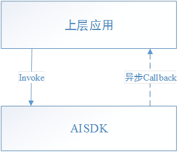
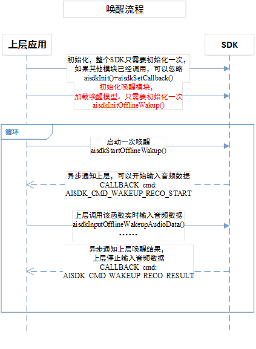
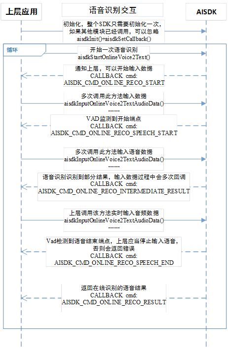
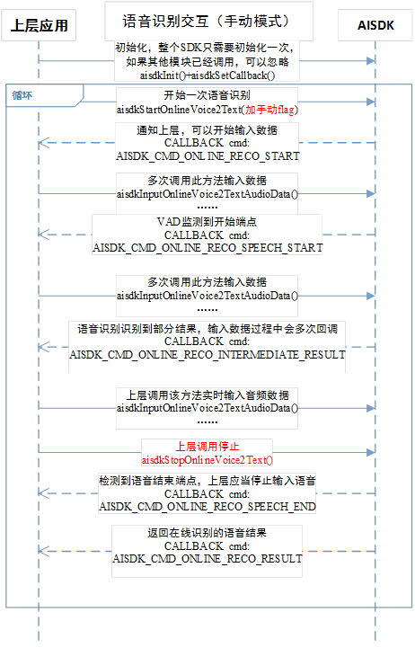
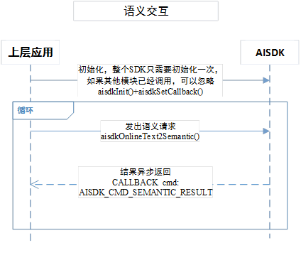
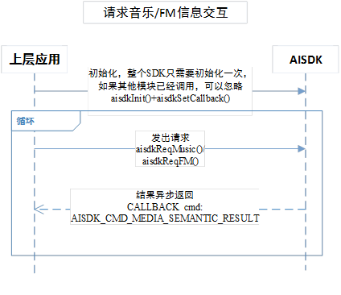
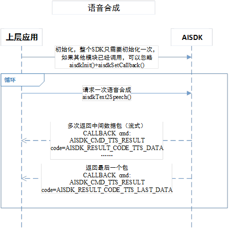

# 1 概述

本文档是叮当设备端的Linux平台SDK接入指引，主要包括在线语音识别、在线语义理解、在线语音合成以及离线语音唤醒等功能，其中语音识别和语音合成均为流式接口。

## 1.1 名词解释
- 设备开放平台SDK：提供腾讯语音唤醒、语音识别、语音合成、语义理解、语义服务技术解决方案的软件开发工具包。
- 语音唤醒：智能硬件/应用在休眠状态下通过个性化语音唤醒词被唤醒。
- 语音识别：将语音转变为对应的语句文本。
- 语义理解：将语句文本转变成结构化的实体、领域、意图、服务数据。
- 语音合成：将语句文本转变为流利的语音。

# 2 编译运行环境
## 2.1 运行硬件要求：
### 2.1.1 CPU
-  位数：32位、64位
-  需要有浮点运算单元
-  频率不做要求，但建议单核1GHz以上，频率低，CPU占用会更高。
       参考：树莓派3上运行压力测试， 批量语音唤醒平均占用13.80%（大模型），批量语音识别平均占用25.40%，批量语音识别同时语音唤醒（大模型）平均占用40.40%。
        语音唤醒小模型CPU占用会大幅度降低。
-  支持平台：mips、arm、x86.

### 2.1.2 内存：
- 建议20M以上。 参考：树莓派3上运行（1G RAM）， SDK平均占用10M内存（RES），峰值12M。

### 2.1.3 磁盘空间：
- SDK：建议预留10MB空间，基础能力SDK占用5MB左右（包括唤醒库和模型）。
- 日志：如果开启日志，额外最多占用20MB磁盘空间。

## 2.2 编译环境要求：
- Linux系统， 内核2.6以上
- 编译环境: 
  - GCC 4.6以上（不带语音唤醒功能）
  - GCC 4.8以上（带语音唤醒功能）

## 2.3 字符编码
默认情况下，传入SDK的文本参数和SDK返回的文本结果，为 UTF-8 编码。

## 2.4 输入音频
语音识别和离线唤醒需要的输入音频格式一致：
| 项目         | 要求            |
| :----------- | :-------------- |
| 音频格式     | PCM格式         |
| 采样精度     | 16位            |
| 采样率       | 16000Hz         |
| 声道         | 1声道（单声道） |
| 字节序       | 小端            |
| 单包建议大小 | 1600字节        |

## 2.5 输出音频
语音合成输出的音频格式如下：
| 项目         | 要求            |
| :----------- | :-------------- |
| 音频格式     | PCM格式         |
| 采样精度     | 16位            |
| 采样率       | 16000Hz         |
| 声道         | 1声道（单声道） |
| 字节序       | 小端            |
| 单包建议大小 | 1600字节        |

# 3 接入指南

## 3.1 准备工作
 - 建立一个工作目录，该目录应当是可读写的，SDK在运行过程中产生的日志和数据会生成到这个目录中，如果不可读写，将会影响语音和语义识别效果。
 - 把res目录下的唤醒模型keywords_model目录复制到SDK可以访问的目录中（建议放在工作目录下）。
 - 把libs文件夹内so动态库复制到编译器可以找到的目录，否则编译时会提示找不到符号的错误。
 - 把include下头文件复制到项目中。

## 3.2 配置文件Config.conf
配置文件可以配置SDK的功能，比如配置网络环境，但功能配置不是必须的（SDK内部会有默认值），必填的是接入方的相关信息，用于SDK获取相关信息上报给服务端标识对应的终端，把配置文件放到上面建立的工作目录中。
配置文件必填的信息如下：

```
    <conf>
        <qua>
            # 请按注释修改内容
            qua_version=3
    
            # 系统平台
            #  ADR    Android平台
            #  IOS    iOS平台
            #  LINUX  Linux平台
            platform=LINUX
    
            # 厂商简称，字母、数字、下划线形式的
            vendor=YourCompanyName
    
            # 产品简称，字母、数字、下划线形式的
            product=speaker
    
            # 版本
            #  GA	预览版
            #  RC	正式版
            #  B1	Release candidate
            #  B2	Beta1
            #  …	Beta2
            #  B9	…
            #  LAB	Beta9
            version=GA
            # 版本号。主版本.子版本.[修正本].[build]，如5.2.0.0880
            version_num=1.0.0.0
            # 包名。与Android包名一致，公司网址倒写，然后加上产品简称即可。
            package=com.YourCompanyName.speaker
    
            # 设备类型：SPEAKER	音箱
            #          PHONE	手机
            #          CAR	    车机
            #          TV	    电视
            device=SPEAKER
        </qua>
    </conf>
```

## 3.3 SDK初始化
初始化方法是在`include/aisdk_common_api.h`中声明的。

     /**
     * @brief SDK初始化函数
     * @param in folderPath 配置路径
     * @param in appKey 应用的appkey，需要从平台申请，接入方必传
     * @param in accessToken 应用的access token，需要从平台申请，接入方必传
     * @param in dsn 设备的序列号（DSN），终端的唯一标识，接入方必传
     * @return <em>0</em>:ok others:fail。 错误码定义见AISDK_ERROR_*常量
     * @note
     */
    AISDK_API_EXPORTS int aisdkInit(const char* folderPath, const char* appKey, const char* accessToken, const char* dsn);
① folderPath 为SDK的工作目录的路径。  
② appKey和accessToken均为在叮当平台新建应用的时候生成的，**必须传递**。dsn（DeviceSerialNumber）为设备的序列号，**必须传递**。后续业务服务端会依赖于这些信息，因此设备信息是必须传递给SDK的。  

## 3.4 设置回调方法
SDK返回给接入方的数据是通过异步回调完成的，接入方需要注册一个回调方法，接收SDK的异步的回调。
注册回调的接口如下：

    /**
     * @brief 设置回调函数
     * @param in callbackPtr 回调函数指针
     * @return
     * @note
     *
     */
    AISDK_API_EXPORTS void aisdkSetCallback(AISDK_CALLBACK callbackPtr);

回调方法的原型为：

    /**
     * @define 设置回调函数原型
     * @param cmd 当前的指令，指示参数data的内容解析方式和含义, 定义由各模块指定(AISDK_CMD_*开头的常量)
     * @param data 数据存储区域
     * @param len data的长度
     * @param userData 传回用户自定义数据，此数据是在用户发起请求是传入的
     * @param userDataLen 用户自定义数据长度
     * @param extraData 附加数据，如果没有返回NULL
     * @param extraDataLen 附加数据长度
     * @warning 不要在回调函数内做任何阻塞的操作。否则会阻塞其他回调。
     *
     * 回调命令
     * @see 参见各接口头文件的AISDK_CMD_*常量定义
     *
    */
    typedef void (AISDK_CALL_CONV *AISDK_CALLBACK)(int cmd, char* data, int dataLen, void* userData, int userDataLen, void *extraData, int extraDataLen);

SDK所有接口都通过这个回调方法异步返回结果，回调带有cmd、data等参数。cmd用来区分不同类型的回调，data用于回传结果。
例如cmd= AISDK_CMD_SEMANTIC_RESULT表示语义请求已经有结果，data为返回的语义和服务的JSON数据。

**注意，在回调方法中的实现不能执行耗时的操作，否则会阻塞SDK的后续流程。**



调用自己需要使用的功能接口，下面将各自说明。

# 4 离线语音唤醒
## 4.1 概述
离线唤醒的接口位于`include/aisdk_wakeup.h`中，唤醒识别依赖动态库`libtwakeup.so`，默认唤醒词为“叮当叮当”。
## 4.2 回调cmd
| CMD                            | 说明                                       |
| :----------------------------- | :----------------------------------------- |
| AISDK_CMD_WAKEUP_RECO_START    | 开始语音唤醒流程，接入方应用可以开始输入语音数据 |
| AISDK_CMD_WAKEUP_RECO_RESULT   | 语音唤醒流程结束，返回结果                 |
| AISDK_CMD_WAKEUP_RECO_ERROR    | 语音唤醒出错。语音唤醒流程结束             |
| AISDK_CMD_WAKEUP_RECO_CANCELED | 语音唤醒出错。语音唤醒流程结束             |
### 4.3 交互流程
#### 4.3.1 正常流程
- 首先需要初始化唤醒模块，调用aisdkInitOfflineWakup(const char * modelPath)，其中modelPath为唤醒模型`keywords_model`的路径。
- 接入方应用（如带有语音唤醒功能的音箱）在启动完毕后可以启动一次唤醒识别流程（aisdkStartOfflineWakeup）。
- 收到cmd=AISDK_CMD_WAKEUP_RECO_START后，接入方应用可以开始录音并实时通过aisdkInputOfflineWakeupAudioData方法向语音唤醒模块输入语音数据，语音唤醒模块会检测语音数据流中的唤醒语音。
- 当检测到唤醒语音，SDK将会发出cmd=AISDK_CMD_WAKEUP_RECO_RESULT的回调，并带有唤醒结果，这样就完成了一次唤醒识别流程。
- 当接入方应用调用aisdkCancelOfflineWakeup时就取消本次唤醒识别流程，此时SDK会发出cmd=AISDK_CMD_WAKEUP_RECO_CANCELED回调。

注意，调用aisdkStartOfflineWakeup方法启动唤醒识别流程后可以一直输入语音数据，不需要每次识别到唤醒后都重新启动识别，即使唤醒后启动了在线语音识别，唤醒识别流程仍然可以并行工作。

交互方式如下：


#### 4.3.2 异常处理
开始唤醒流程后，发生引擎错误会产生cmd=AISDK_CMD_WAKEUP_RECO_ERROR的回调，接入方应当停止输入音频。可以尝试重新开启一次唤醒（aisdkStartOfflineWakeup）。

## 4.4. 回调命令的数据格式
### 4.4.1	AISDK_CMD_WAKEUP_RECO_RESULT回调

data数据格式如下：

    {
       "rc":0,	   
       "result":{
           "code":0，//0表示识别到唤醒词，1表示取消
           "data":"ding1dang1ding1dang1",  //识别到的唤醒词
           "begin_time":"840",  //唤醒词开始时间ms
           "end_time":"940"     //唤醒词结束时间ms
       } 
    }
code值如下：
| 值   | 常量                              | 说明                                                         |
| :--- | :-------------------------------- | :----------------------------------------------------------- |
| 0    | AISDK_RESULT_CODE_WAKEUP_OK       | 唤醒成功，识别到唤醒词                                       |
| 1    | AISDK_RESULT_CODE_WAKEUP_CANCELED | 取消唤醒，当调用aisdkCancelOfflineWakeup时会有此情况。取消后，语音唤醒流程结束 |

### 4.4.2	AISDK_CMD_WAKEUP_RECO_ERROR回调

data数据格式如下：	

    {
       "rc":1, //返回码 
       "error":{			
           "code":错误码,  
           "message":"错误信息" 
       } 
    }

code值如下：
| 值   | 常量                                         | 说明                     |
| :--- | :------------------------------------------- | :----------------------- |
| 7000 | AISDK_ERROR_WAKEUP_RECO_FAILED               | 唤醒引擎错误             |
| 7001 | AISDK_ERROR_WAKEUP_RECO_NOT_STARTED          | 未开始识别就输入语音     |
| 7002 | AISDK_ERROR_WAKEUP_RECO_CREATE_HANDLE_FAILED | 创建离线唤醒识别模块失败 |
| 7003 | AISDK_ERROR_WAKEUP_RECO_MODULE_UNAVAILABLE   | SDK没有包含唤醒模块      |

## 4.5 配置项说明
#### AISDK_CONFIG_WAKEUP_SAVE_SPEECH
配置是否保存录音，所有输入音频都保存在一个文件中，默认关闭。
使用举例：
```
//保存录音
aisdkSetConfig(AISDK_CONFIG_WAKEUP_SAVE_SPEECH,"1");
```

# 5 在线语音识别
## 5.1 概述
在线语音识别的接口，用于流式识别语音流中的文本。
语音识别有以下几种模式：

 - 自动模式（默认）
    自动检测语音输入的结束并返回语音识别结果。
 - 手动模式（AISDK_FLAG_ONLINE_RECO_MANUAL_MODE）
    语音识别模块不会自动结束，接入方主动调用stop才会结束并返回结果。手动模式比较适合通过按键启动和结束语音识别的场景。
 - 全流程模式（AISDK_FLAG_ONLINE_RECO_FULL_MODE）
    全流程模式可以通过语音识别的接口完成语音识别、语义识别、tts合成整个流程，简化接入方的工作量。

这些模式在调用启动语音识别接口aisdkStartOnlineVoice2Text(void* userData, int len, int flags)时传给flags参数。

## 5.2 回调cmd
| CMD                                       | 说明                                                         |
| :---------------------------------------- | :----------------------------------------------------------- |
| AISDK_CMD_ONLINE_RECO_START               | 本次语音识别已经启动，接入方可以开始输入录音数据               |
| AISDK_CMD_ONLINE_RECO_SPEECH_START        | 语音检测到开始端点                                           |
| AISDK_CMD_ONLINE_RECO_SPEECH_END          | 语音检测到结束端点，接入方应停止输入录音数据                     |
| AISDK_CMD_ONLINE_RECO_RESULT              | 返回在线识别结果，本次语音识别结束                           |
| AISDK_CMD_ONLINE_RECO_INTERMEDIATE_RESULT | 上报在线识别的中间结果。一句话没有说完的时候，返回的部分识别文字。识别过程中多次回调 |
| AISDK_CMD_ONLINE_RECO_DATA_VOLUME         | 上报输入音频数据的音量值（or 能量值）。可以用来显示实时录音的语音音量水平。取值范围是0-25。每次输入语音数据包都会回调 |
| AISDK_CMD_ONLINE_RECO_ERROR               | 错误发生。本次语音识别结束，接入方应停止输入录音数据             |
| AISDK_CMD_ONLINE_RECO_TIMEOUT             | 静音超时：在10s内没有检测到语音开始端点。本次语音识别结束，接入方应停止输入录音数据 |
| AISDK_CMD_ONLINE_RECO_CANCELED            | 取消：当接入方调用aisdkCancelOnlineVoice2Text()时，SDK会发出这个回调。本次语音识别结束，接入方应停止输入录音数据 |
| AISDK_CMD_ONLINE_RECO_SPEECH_TIMEOUT      | 识别超时：识别到说话开始后，10s后未检测到有效的识别结果，接入方应停止输入录音数据                |
| AISDK_CMD_ONLINE_RECO_FULL_MODE_FINISHED      | 完整模式的在线识别流程结束（以FULL_MODE启动时才会回调）                |

## 5.3 交互流程
### 5.3.1 自动结束
- 调用aisdkStartOnlineVoice2Text方法启动语音识别，传入flags为0标识自动结束。
- 根据录音频率调用aisdkInputOnlineVoice2TextAudioData方法输入语音。
- SDK自动识别语音的结束点并返回识别结果，

交互方式如下：

SDK初始化在整个应用使用中，只需要调用一次，若其他功能模块或者本模块已经调用过，不需要再次调用。

### 5.3.2 手动结束
SDK也支持手动模式，不自动结束语音识别，以实现按键形式的控制。
使用方法是：
- 在调用aisdkStartOnlineVoice2Text方法时，传入AISDK_FLAG_ONLINE_RECO_MANUAL_MODE（如用户按下按键开始）
- 根据录音频率调用aisdkInputOnlineVoice2TextAudioData方法输入语音。
- 接入方要结束语音输入的时候调用aisdkStopOnlineVoice2Text（如用户松开按键结束录音），SDK会返回识别结果。

交互流程如下：


### 5.3.3 取消识别
语音识别提供了取消接口：aisdkCancelOnlineVoice2Text()
在调用aisdkStartOnlineVoice2Text后，可以调用aisdkCancelOnlineVoice2Text取消整个识别流程。可能的使用场景是：1. 某个业务要打断当前的语音识别流程。 

## 5.4. 回调命令的数据格式
### 5.4.1	AISDK_CMD_ONLINE_RECO_INTERMEDIATE_RESULT回调

data数据格式如下：

    {
       "rc":0,  
       "result":{
           "code":0, 
           "data":"识别到部分语音结果" 
       } 
    }

### 5.4.2	AISDK_CMD_ONLINE_RECO_RESULT回调
data数据格式如下：

    {
       "rc":0,  
       "result":{
           "code":0,  
           "data":"识别到的结果"  
       } 
    }

code如下：
| 值   | 常量                        | 说明     |
| :--- | :-------------------------- | :------- |
| 0    | AISDK_RESULT_CODE_ONLINE_OK | 识别正常 |

### 5.4.3	AISDK_CMD_ONLINE_RECO_ERROR回调
data数据格式如下：

    {
       "rc":1,  
       "error":{
           "code":错误码, 
           "message":"错误信息" 
       } 
    }

code如下：
| 值   | 常量                                     | 说明             |
| :--- | :--------------------------------------- | :--------------- |
| 5    | AISDK_ERROR_COMMON_NETWORK_FAIL          | 网络请求发送失败 |
| 6    | AISDK_ERROR_COMMON_NETWORK_RESPONSE_FAIL | 网络请求回包失败 |
| 7    | AISDK_ERROR_COMMON_NETWORK_TIMEOUT       | 网络请求超时     |
| 10   | AISDK_ERROR_COMMOM_SERVICE_RESP          | 后台服务异常     |

## 5.5 配置项说明
#### AISDK_CONFIG_VOICE_ONLINE_TIMEOUT
配置在线语音超时时间，默认10s。  
使用举例：
```
aisdkSetConfig(AISDK_CONFIG_VOICE_ONLINE_TIMEOUT,"10000");
```

#### AISDK_CONFIG_VOICE_ONLINE_ENABLE_CLOUDVAD
配置是否开启云端VAD，默认开启。  
使用举例：
```
//设置开启云端VAD
aisdkSetConfig(AISDK_CONFIG_VOICE_ONLINE_ENABLE_CLOUDVAD,AISDK_CONFIG_VALUE_ENABLE);
```

#### AISDK_CONFIG_VOICE_ONLINE_ENABLE_CALCULATE_VOLUME
配置是否开启计算音量，默认关闭。  
使用举例：
```
//设置开启计算音量
aisdkSetConfig(AISDK_CONFIG_VOICE_ONLINE_ENABLE_CALCULATE_VOLUME,AISDK_CONFIG_VALUE_ENABLE);
```

#### AISDK_CONFIG_VOICE_VAD_SILENT_MAX
配置oneshot短模式vad静音超时时间，默认500ms，用于检查唤醒后用户在启动识别后的指定时间内是否开始说话，如果没有说话可以播放唤醒提示音避免用户唤醒后连续说话时播放提示音干扰用户。 超时的回调命令是AISDK_CMD_ONLINE_RECO_ONESHOT_SHORT_MODE_TIMEOUT。    
使用举例：
```
//设置静音时间为500ms
aisdkSetConfig(AISDK_CONFIG_VAD_SILENT_MAX,"500");
```

#### AISDK_CONFIG_VOICE_ONLINE_SAVE_SPEECH
配置是否保存录音，默认关闭，定位识别问题时可以打开，SDK会保存录音用于分析。  
使用举例：
```
//保存录音
aisdkSetConfig(AISDK_CONFIG_VOICE_ONLINE_SAVE_SPEECH,AISDK_CONFIG_VALUE_ENABLE);
```

### AISDK_CONFIG_VOICE_ONLINE_SIL_TIMEOUT
设置语音识别的静音超时时间，默认10s。  
使用举例：
```
aisdkSetConfig(AISDK_CONFIG_VOICE_ONLINE_SIL_TIMEOUT,"10000");
```

#### AISDK_CONFIG_VOICE_ONLINE_SIL_TIME
设置语音识别的尾部静音结束时间，默认500ms。  
使用举例：
```
aisdkSetConfig(AISDK_CONFIG_VOICE_ONLINE_SIL_TIME,"500");
```

### AISDK_CONFIG_VOICE_ONLINE_USER_LOCAL_VAD
是否使用本地vad结束，默认开启。  
使用举例：
```
aisdkSetConfig(AISDK_CONFIG_VOICE_ONLINE_USER_LOCAL_VAD,AISDK_CONFIG_VALUE_ENABLE);
```

#### AISDK_CONFIG_VOICE_ONLINE_AUDIO_PACKET_SIZE
在线识别发送的语音数据包大小，默认3200字节。  
使用举例：
```
aisdkSetConfig(AISDK_CONFIG_VOICE_ONLINE_AUDIO_PACKET_SIZE,"2048");
```

#### AISDK_CONFIG_VOICE_ONLINE_INPUT_ENCODED_DATA
配置语音识别的输入音频是否已编码，对输入已编码的音频SDK不会再做编码，默认输入未编码音频。  
使用举例：
```
// 配置输入已编码音频
aisdkSetConfig(AISDK_CONFIG_VOICE_ONLINE_INPUT_ENCODED_DATA,AISDK_CONFIG_VALUE_ENABLE);
```

#### AISDK_CONFIG_VOICE_ONLINE_ONLY_DETECT_VAD
配置是否只识别VAD，配置后不会发起在线语音识别，只回调VAD的开始和结束。  
使用举例：
```
aisdkSetConfig(AISDK_CONFIG_VOICE_ONLINE_ONLY_DETECT_VAD,AISDK_CONFIG_VALUE_ENABLE);
```

# 6 在线语义
## 6.1 概述
语义模块可以对输入的文本做语义识别，得到的对应的领域和意图、语义实体，并返回对应的服务数据。例如把“我想听周杰伦的歌曲”识别为领域为music、意图为play，带有的语义实体是歌手名字为“周杰伦”，服务数据为周杰伦的歌曲列表。
SDK只会返回JSON数据，不做后续的业务逻辑，如播放音乐需要由接入方应用实现。

## 6.2 回调cmd
| CMD                             | 说明                                         |
| :------------------------------ | :------------------------------------------- |
| AISDK_CMD_SEMANTIC_RESULT       | 返回在线语义识别结果。语义识别流程结束       |
| AISDK_CMD_MEDIA_SEMANTIC_RESULT | 返回请求音乐、FM信息的结果。语义识别流程结束 |
| AISDK_CMD_SEMANTIC_ERROR        | 在线语义识别错误。语义识别流程结束           |
| AISDK_CMD_MEDIA_SEMANTIC_ERROR  | 请求音乐、FM错误。语义识别流程结束           |

## 6.3 交互流程
### 6.3.1 请求语义
请求语义的交互流程如下：

当返回的语义结果的 `session==false` ，需要进行多轮交互

### 6.3.2 功能性接口
除了常规的请求语义的接口aisdkOnlineText2Semantic方法，语义识别模块还提供了一些接口来实现特殊功能。
一般情况播放服务返回的音乐/FM的url即可，但如果没有马上播放，服务返回的音乐播放地址，可能会有变化。此时可以用媒体ID播放音乐或者FM，建议先使用调用aisdkReqMusic和aisdkReqFM方法重新请求媒体ID对应的音乐/FM的播放地址，在进行播放。
请求单个音乐或者FM信息的流程如下：


## 6.4 数据格式
### 6.4.1	AISDK_CMD_SEMANTIC_RESULT/AISDK_CMD_MEDIA_SEMANTIC_RESULT回调
data数据格式如下：

    {
        "rc":0, //返回码，0表示正常   
       	……//其他字段
    }

具体服务数据格式可以参考[语义服务数据文档](https://github.com/TVSTeam/TVS-Device-SDK/tree/master/%E8%AF%AD%E4%B9%89%E6%9C%8D%E5%8A%A1%E6%95%B0%E6%8D%AE%E6%96%87%E6%A1%A3)
    
### 6.4.2	AISDK_CMD_SEMANTIC_ERROR/AISDK_CMD_MEDIA_SEMANTIC_ERROR回调
data数据格式如下：

    {
       "rc":1,  
       "error":{
           "code":错误码, 
           "message":"错误信息" 
       } 
    }

code如下：
| 值   | 常量                            | 说明                             |
| :--- | :------------------------------ | :------------------------------- |
| 5    | AISDK_ERROR_COMMON_NETWORK_FAIL | 网络请求发送失败。请检查网络状态 |
| 10   | AISDK_ERROR_COMMOM_SERVICE_RESP | 后台服务异常                     |


# 7 在线语音合成
## 7.1 概述
语音合成的接口，可以将文本转换语音数据。SDK没有播放音频的功能，接入方自行处理语音数据。

## 7.2 回调cmd
| CMD                  | 说明                                   |
| :------------------- | :------------------------------------- |
| AISDK_CMD_TTS_RESULT | 返回语音合成处理结果。语音合成流程结束 |
| AISDK_CMD_TTS_ERROR  | 语音合成错误。语音合成流程结束         |

## 7.3 交互流程
### 7.3.1 请求语义
接入方调用aisdkText2Speech方法传入要合成语音的文本，SDK会返回合成后的音频流，注意，语音合成是流式的，可能回调多次，中间语音数据包的code为AISDK_RESULT_CODE_TTS_DATA，最后一个返回的语音数据包的code为AISDK_RESULT_CODE_TTS_LAST_DATA。

短文本的语音合成请求的结果一次性返回，语音数据包的code为AISDK_RESULT_CODE_TTS_LAST_DATA。
	


## 7.4. 数据格式
### 7.4.1	AISDK_CMD_TTS_RESULT回调
**注意：音频流数据从extraData中返回**

data数据格式如下：

    {
        "rc":0,   
        "result":{
           "code":code, //标识是否是最后一个包
       } 
    }
code如下：
| 值   | 常量                            | 说明                                               |
| :--- | :------------------------------ | :------------------------------------------------- |
| 0    | AISDK_RESULT_CODE_TTS_DATA      | 表示data中的数据不是最后一个音频数据包             |
| 1    | AISDK_RESULT_CODE_TTS_LAST_DATA | 表示data中的数据是最后一个音频数据包。语音合成完成 |

### 7.4.2	AISDK_CMD_TTS_ERROR回调
data数据格式如下：

    {
       "rc":1, 
       "error":{
           "code":错误码,
           "message":"错误信息"   
       } 
    }

code如下：
| 值   | 常量                                     | 说明             |
| :--- | :--------------------------------------- | :--------------- |
| 5    | AISDK_ERROR_COMMON_NETWORK_FAIL          | 网络请求发送失败 |
| 6    | AISDK_ERROR_COMMON_NETWORK_RESPONSE_FAIL | 网络请求回包失败 |
| 7    | AISDK_ERROR_COMMON_NETWORK_TIMEOUT       | 网络请求超时     |
| 10   | AISDK_ERROR_COMMOM_SERVICE_RESP          | 后台服务异常     |

## 7.5 配置项说明
#### AISDK_CONFIG_TTS_VOLUME
配置TTS的音量大小，默认值50。  
使用举例：
```
aisdkSetConfig(AISDK_CONFIG_TTS_VOLUME,"50");
```

# 8 OneShot语音识别
## 8.1 概述
OneShot指的是用户可以把唤醒词和命令词连起来说，比如“叮当叮当，今天天气怎么样”，用前面提到的【离线语音唤醒】和【在线语音识别】接口也可以实现OneShot的效果，但是要求接入方在唤醒后把紧接着的音频输入到在线语音识别接口，如果输入的音频不连续，会影响到OneShot的效果。

本节介绍的OneShot接口的优点是，只需要一套接口，启动OneShot流程后SDK就会自动在唤醒识别和语音识别两个状态之间切换，接入方只需要一直输入音频，SDK内部保证在唤醒后把后续输入的音频发给服务端识别，从而实现OneShot的效果，得到识别结果后会自动再切换到唤醒识别，接入方不需要反复重启OneShot。

使用OneShot接口可以完全替代【离线语音唤醒】和【在线语音识别】接口，两套接口不可以同时使用。

## 8.2 交互流程
主要流程：
- 调用aisdkInitOneShot初始化OneShot，需要传入vad模型路径（可选，没有可以传NULL）和唤醒模型路径（必传，否则无法唤醒）。
- 调用aisdkStartOneShot启动OneShot语音识别，flags参数和启动在线语音识别的接口一致。
- 调用aisdkInputOneShotAudioData输入音频。
- 处理SDK的回调，包括唤醒识别的回调和语音识别的回调，回调的命令跟【离线语音唤醒】和【在线语音识别】一致。
- 如果要停止OneShot，调用aisdkStopOneShot停止整个流程。如果还想继续识别唤醒和语音，不需要调用这个接口，继续输入音频即可。

其他流程：
- 如果需要手动唤醒，调用aisdkStartOneShotOnlineVoice2Text启动一次在线语音识别，参数和【在线语音识别】的接口一致。
- 如果要取消进行中的在线语音识别，调用aisdkCancelOneShotOnlineVoice2Text。
- 如果要手动停止进行中的在线语音识别并获取识别结果，调用aisdkStopOneShotOnlineVoice2Text。

## 8.3 回调cmd
| CMD                  | 说明                                   |
| :------------------- | :------------------------------------- |
| AISDK_CMD_ONE_SHOT_START | ONESHOT模式开启 |
| AISDK_CMD_ONE_SHOT_STOP  | ONESHOT模式结束 |

# 9 账号管理
## 9.1 概述
因为有些服务需要校验用户的账号信息，比如音乐、闹钟提醒等，因此SDK支持传入用户的账号信息，并在后续请求语义和服务数据时带上账号信息，如果是微信账号登录，还支持定时刷票。

SDK支持的账号类型包括微信和QQ。

注意：若要使用账号信息，需要接入叮当的手机端SDK登录并获取SDK需要的账号信息，接入手机端SDK不在本文的讨论范围，请参考[腾讯叮当手机端SDK](https://github.com/TencentDingdang/dmsdk)。

## 9.2 交互流程
- 设置账号信息，调用aisdkSetAccountByClientId，传入的参数是通过手机端SDK登陆后获取的。
- 获取之前设置过的账号信息，调用aisdkGetAccountClientId，参数返回账号信息。
- 如果用户解除绑定，需要清空账号信息，调用aisdkClearAccount。

# 10 其他接口
## 10.1 明确意图说明
### 10.1.1 简介
当开发者已经知道语义，想去直接获得服务数据时，可以调用aisdkComplexSemantic2Semantic方法。

### 10.1.2 回调cmd
| CMD                               | 说明                             |
| :-------------------------------- | :------------------------------- |
| AISDK_CMD_COMPLEX_SEMANTIC_RESULT | 返回数据，解析方法与在线语义相同 |
| AISDK_CMD_COMPLEX_SEMANTIC_ERROR  | 明确意图出错                     |

### 10.1.3 交互流程
与在线语义相同

### 10.1.4 数据格式
返回数据格式与在线语义相同

### 10.1.5 接口方法

    aisdkComplexSemantic2Semantic(const char* semanticJson, int len, void *userData, int userDataLen);

其中semanticJson为json结构字符串。
总体结构如下：
| 字段             | 类型      | 说明                                                         |
| :--------------- | :-------- | :----------------------------------------------------------- |
| service          | string    | 领域                                                         |
| operation        | string    | 意图                                                         |
| query            | string    | 查询字符串，可以填空串，一般服务端忽略这个字段                 |
| session_complete | bool      | 会话是否结束，默认可填false                                  |
| slots            | JSONArray | 实体列表。可不填。与《SDK语义格式.pdf》所列的semantic/slots一致。注意：每个意图所需要的slots都不一样 |

### 10.1.6 明确意图举例
- 播放歌曲示例：
```
{
	"query": "",
	"service": "music",
	"operation": "play"
	"session_complete":true
}
```    

这个请求没有指定实体，服务端将会随机返回歌曲。

- 播放歌曲（指定周杰伦）:
```
    {"query": "","service": "music","operation": "play","slots": [{"name": "singer","type": "sys.music.singer","slot_struct": 1,"values": [{"text": "周杰伦"}]}],"session_complete": true}
```    

这个请求slots内填了周杰伦这个实体，服务端将会返回周杰伦的歌曲。

- 查询上海天气：

```
    {"query": "","service": "weather","operation": "general_search","slots": [{"name": "location","type": "sys.geo.county","slot_struct": 2,"values": [{"original_text": "上海","country": "","province": "","city": "上海","district": "","town": "","street": "","longitude": 0,"latitude": 0,"vLBSKeyData": {"type": "Buffer","data": []},"title": "","village": "","residual": "","source": 0}],"prompt": {"show_text": "","speak_text": "","prompt_type": 0,"slot_name": "","slot_type": ""}}],"session_complete": true}
```    

这个请求slots内填了上海这个位置实体，服务端将会返回上海的天气。

    
- 播完一首自动请求下一首
```
{
   "query" : "",
   "service" : "music",
   "operation" : "auto_next",
   "session_complete" : true
}
```

- 同步闹钟数据
```
{
	"query": "",
	"service": "alarm",
	"operation": "check"
	"session_complete":true
}
```

- 删除云端闹钟数据
```
{
	"query":"",
	"service":"alarm",
	"operation":"delete",
	"session_complete":true,
	"slots":[
    	{"name":"confirm","prompt":{"prompt_type":0,"show_text":"","slot_name":"","slot_type":"","speak_text":""},"slot_struct":5,"type":"sys.confirm","values":[{"confirm":2}]},
    	{"name":"ordinal","prompt":{"prompt_type":0,"show_text":"","slot_name":"","slot_type":"","speak_text":""},"slot_struct":3,"type":"sys.number.ordinal","values":[{"decimal":"","fraction":"","integer":"","number_type":4,"ordinal":"[]","original_offset":2,"original_text":"所有"}]}
	]
}
```

## 10.2 状态上报接口
### 10.2.1 简介
终端有些状态的变化需要通知服务端，比如闹钟响铃，服务端收到后可以更新云端的闹钟列表，甚至同步到其他端。这种情况可以调用aisdk_report_online.h头文件提供的aisdkReportClientState方法。

### 10.2.2 接口方法

    void aisdkReportClientState(const char* sJsonData);

| 参数      | 说明                                                         |
| :-------- | :----------------------------------------------------------- |
| sJsonData | 要上报的内容，JSON格式，各类型的上报对应的数据会有不同，下面介绍 |

### 10.2.3 上报类型和数据说明
#### 10.2.3.1 闹钟数据上报
```
{
    "businessType":6,	// 标识闹钟状态上报
    "calendarList":[		// 闹钟状态列表，每次最多10个，超过请分批上报
    {
        "report_type":1,	// 参见 E_REMINDER_REPORT_TYPE
        "event_type":1,	// 参见 E_REMINDER_EVENT_TYPE
        "calendar_type":0,	// 参见 E_REPEAT_TYPE
        "calendar_id":1522379260112,	// 闹钟唯一ID 服务端下发
        "calendar_time":1522379320,		// 事件发生时间 与 calendar_id 对应，均有服务端下发
        "calendar_note":"喝水"	// 提醒事件
    }
    ]
}
```

取值说明：
```
// 提醒类型 闹钟/提醒
enum E_REMINDER_EVENT_TYPE {
    E_REMINDER_ALARM = 0, // 闹钟
    E_REMINDER_REMINDER = 1 // 提醒
};
```

上报事件类型：
```
enum E_REMINDER_REPORT_TYPE {
    E_REMINDER_REPORT_NO_SIGN = 0, // 无意义 服务接收到该类型时 会丢弃请求
    E_REMINDER_REPORT_SET_SECCESS = 1, // 闹钟设置成功
    E_REMINDER_REPORT_SET_FAILURE = 2, // 闹钟设置失败
    E_REMINDER_REPORT_DELETE_SECCESS = 3, // 闹钟删除成功
    E_REMINDER_REPORT_DELETE_FAILURE = 4, // 闹钟删除失败
    E_REMINDER_REPORT_START = 5, // 闹钟开始响铃
    E_REMINDER_REPORT_STOP = 6, // 闹钟停止响铃
};
```

闹钟重复类型：
```
enum E_REPEAT_TYPE {
    E_REPEAT_ONCE = 0, // 一次性闹钟
    E_REPEAT_DAY = 1, // 按天重复
    E_REPEAT_WEEK = 2, // 按周重复
    E_REPEAT_MONTH = 3, // 按月重复
    E_REPEAT_WORKDAY = 4, // 按工作日重复
    E_REPEAT_WEEKEND = 5, // 按节假日重复
    E_REPEAT_SELF = 6, // 无效 服务接收到该类型时 会丢弃请求
    E_REPEAT_HOUR = 7, // 无效 服务接收到该类型时 会丢弃请求
    E_REPEAT_EXCEPT = 8 // 无效 服务接收到该类型时 会丢弃请求
};
```

#### 10.2.3.2 音量数据上报
```
{
    businessType":7,	// 上报类型
    "minVolume":10,	    // 最小音量，厂商自定义
    "maxVolume":100,	// 最大音量，厂商自定义
    "curVolume":50,	    // 当前音量
    "step":10,		    // 调整音量步长，厂商自定义
    "lastVolume":50	    // 调整前音量
}
```        
#### 10.2.3.3 媒体播放状态上报
```
{
    "businessType":0,
    "strDomain":"music",        // 领域
    "strIntent":"play",		    // 意图
    "strId":"12345678",		    // 媒体ID
    "ePlayState":1,    		    // 播放状态
    "offset":0			        // 播放进度
}   
```        
ePlayState取值说明：
```
enum EPlayState
{
    EPlaying                    =   1,                      //  播放状态
    EPaused                     =   2,                      //  暂停状态
    EStopped                    =   3,                      //  停止状态
    EStarted                    =   4,                      //  开始状态
    EFinished                   =   5,                      //  结束状态
    EIdle                       =   6,                      //  空闲状态
    EBufferUnderRun             =   7,                      //  卡顿状态
    EInterrupted                =   8,                      //  打断状态
    EReset                      =   9,                      //  端重启后调用 
};
```

# Q&A
## Q：如何切换网络环境？
A：使用配置项AISDK_CONFIG_ENV_TYPE设置，网络环境的选择有：
```
/**
 * 网络环境：正式环境
 */
const char* const AISDK_CONFIG_VALUE_ENV_TYPE_FORMAL = "0";
//
/**
 * 网络环境：测试环境
 */
const char* const AISDK_CONFIG_VALUE_ENV_TYPE_TEST = "1";
//
/**
 * 网络环境：体验环境
 */
const char* const AISDK_CONFIG_VALUE_ENV_TYPE_EXP = "2";
```
使用举例：
```
aisdkSetConfig(AISDK_CONFIG_ENV_TYPE,AISDK_CONFIG_VALUE_ENV_TYPE_TEST);
```

## Q：如何选择返回的TTS音频格式？
A：使用配置项AISDK_CONFIG_TTS_TYPE设置，TTS音频格式的可选值有：
```
/**
 * TTS格式：MP3
 */
const char* const AISDK_CONFIG_VALUE_TTS_TYPE_MP3 = "0";
//
/**
 * TTS格式：WAV（PCM）
 */
const char* const AISDK_CONFIG_VALUE_TTS_TYPE_WAV = "1";
//
/**
 * TTS格式：AMR
 */
const char* const AISDK_CONFIG_VALUE_TTS_TYPE_AMR = "2";
```
使用举例：
```
aisdkSetConfig(AISDK_CONFIG_TTS_TYPE,AISDK_CONFIG_VALUE_TTS_TYPE_WAV);
```

## Q：如何设置日志的级别？
A：SDK为便与调试默认会按DEBUG级别打印日志，对于磁盘空间比较小的设备可能会有压力，或者正式发布后不希望打印详细日志，可使用AISDK_CONFIG_LOG_LEVEL设置日志级别。
日志级别的可选项有：
```
/**
 * 日志级别，debug
 */
const char* const AISDK_CONFIG_VALUE_LOG_LEVEL_DEBUG = "5";
/**
 * 日志级别，info
 */
const char* const AISDK_CONFIG_VALUE_LOG_LEVEL_INFO = "4";
/**
 * 日志级别，warn
 */
const char* const AISDK_CONFIG_VALUE_LOG_LEVEL_WARN = "3";
/**
 * 日志级别，error
 */
const char* const AISDK_CONFIG_VALUE_LOG_LEVEL_ERROR = "2";
/**
 * 日志级别，none
 */
const char* const AISDK_CONFIG_VALUE_LOG_LEVEL_NONE = "1";
```
使用举例：
```
aisdkSetConfig(AISDK_CONFIG_LOG_LEVEL,AISDK_CONFIG_VALUE_LOG_LEVEL_DEBUG);
```

## Q：如何设置设备的位置信息？
A：有些情况服务端可能需要终端的位置信息以提供更好的服务，比如查询天气，如果设备有定位能力，可以使用AISDK_CONFIG_LBS_DATA设置位置信息，SDK会在请求服务数据时带上位置信息给服务端使用。

使用举例：
```
aisdkSetConfig(AISDK_CONFIG_LBS_DATA,"113.930770|22.543501");
```

## Q：如何获取设备的GUID？
A：GUID是SDK自动请求服务端根据Appkey、AccessToken、DeviceSerialNumber生成的设备唯一标识，保存在SDK内部，有时服务端定位问题需要提供终端的GUID，可以使用AISDK_CONFIG_GUID配置项获取。

使用举例：
```
string guid = aisdkGetConfig(AISDK_CONFIG_GUID);
```

## Q：如何获取设备的QUA？
A：QUA是终端的厂商、产品名称、系统平台、软件版本号、程序包名、设备类型等组成的设备信息，由SDK根据配置文件或者aisdkSetQUA方法设置的信息拼接组成的，有时服务端定位问题需要提供终端的QUA，可以使用AISDK_CONFIG_QUA配置项获取。

使用举例：
```
aisdkGetConfig(AISDK_CONFIG_QUA);
```

## Q：网络状态变化如何通知SDK？
A：设备刚启动时联网可能需要一些时间，在设备未连上网络时初始化SDK，SDK的一些初始化流程（例如获取GUID、建立push通道、上报设备状态等）可能无法完成，所以需要外部在网络状态变化时通知SDK，可以帮助SDK在网络连上时尽快处理未完成的工作。使用配置项AISDK_CONFIG_NETWORK_STATUS设置网络状态。

使用举例：
```
//配置当前网络为有网
aisdkSetConfig(AISDK_CONFIG_NETWORK_STATUS, "1");
```

## Q：如何切换到语义沙箱环境？
A：语义服务会把开发中的特性先发布到沙箱环境验证，验证通过后才会发到正式环境，因此如果需要和语义服务调试开发特性，需要切到语义的沙箱环境，使用AISDK_CONFIG_OPEN_SANDBOX切到语义沙箱环境。
注意，此配置和切换网络环境的配置项可同时使用，这个配置只是配置语义的服务环境。

使用举例：
```
aisdkSetConfig(AISDK_CONFIG_OPEN_SANDBOX, AISDK_CONFIG_VALUE_ENABLE);
```

## Q：如何传入非PCM的音频做语音识别？
A：SDK语音识别默认接受的音频数据是PCM格式的，如果有输入非PCM格式音频的需求，例如蓝牙耳机设备，可能在耳机上做opus压缩再传给手机APP识别，就需要配置好SDK接受已编码数据，否则SDK会把输入的音频当做PCM格式处理。

以输入opus格式数据为例说明如何配置：
```
// 配置输入已编码音频
aisdkSetConfig(AISDK_CONFIG_VOICE_ONLINE_INPUT_ENCODED_DATA,"1");

// 配置语音识别的语音编码格式为opus
aisdkSetConfig(AISDK_CONFIG_AUDIO_FORMAT,"7");
```

## Q：接入SDK后为什么无法唤醒？
A：请检查以下几点：
- 是否有放置唤醒库libtwakeup.so到设备上，且路径可以找到
- 是否有注册回调给SDK
- 是否有放置唤醒模型，并在初始化时把路径传给aisdkInitOfflineWakeup方法，aisdkInitOfflineWakeup是否有返回错误码
- 是否有调用aisdkStartOfflineWakeup方法启动唤醒识别，aisdkStartOfflineWakeup是否有返回错误码
- 是否有调用aisdkInputOfflineWakeupAudioData方法传入录音音频给SDK
- 如果以上都没问题，请打开SDK的唤醒录音保存开关AISDK_CONFIG_WAKEUP_SAVE_SPEECH，SDK会把录音保存在工作目录下，听录音确认输入的音频有没有问题

## Q：SDK的日志如何获取？
A：各平台的SDK保存日志的路径如下：
- Android端：在sd卡的应用工作目录下：/sdcard/Android/data/<package_name>/files/log
- iOS端：iTunes->设备页面->文件共享->应用->aisdk文件夹
- Linux端：在调用初始化方法时传入的路径下的log文件夹


        