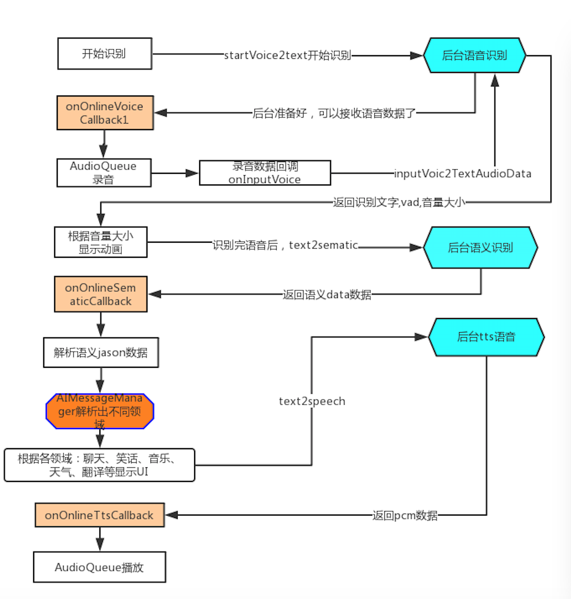
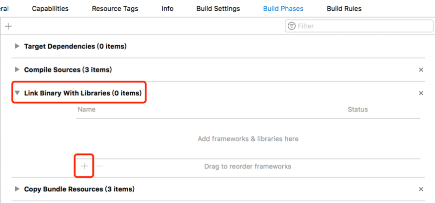
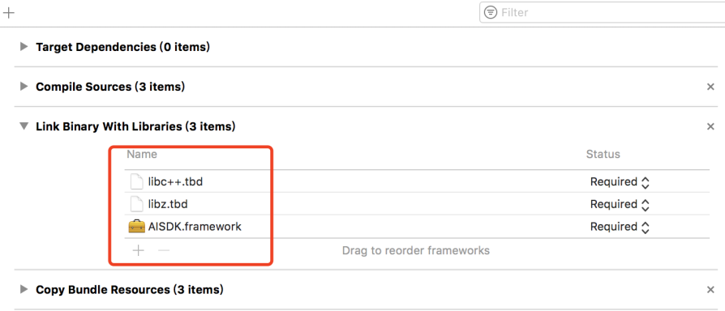
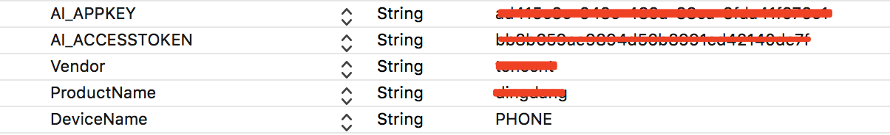
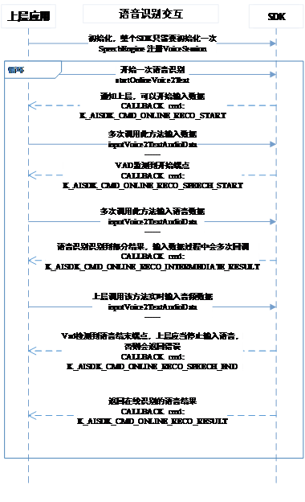
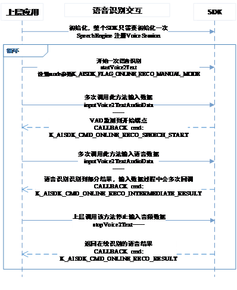
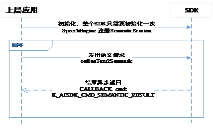
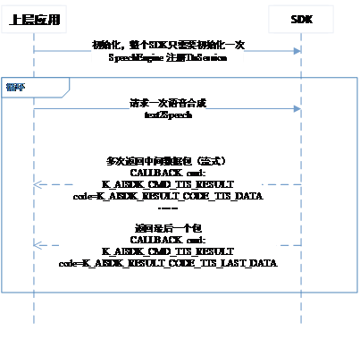
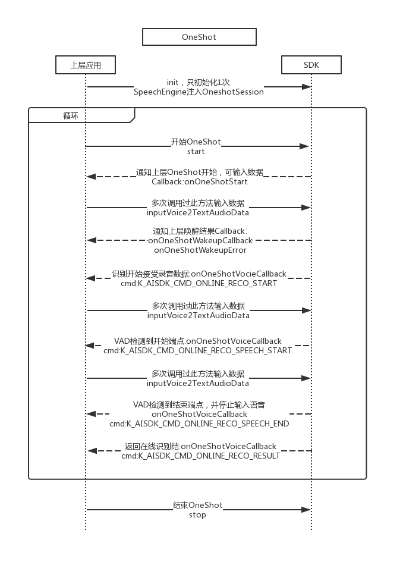
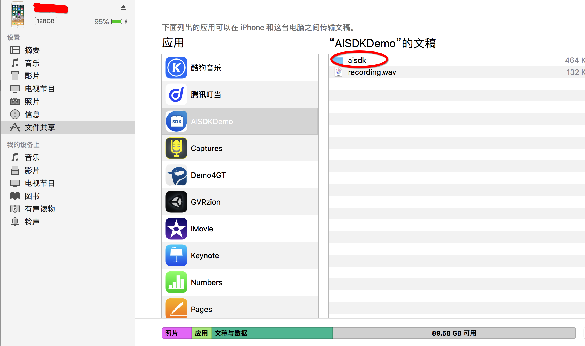

#   iOS SDK #
## 1.概述 ##
本文档是叮当设备端的iOS平台SDK接入指引，主要包括在线语音识别、在线语义理解、在线语音合成以及离线语音唤醒等功能，其中语音识别和语音合成均为流式接口。
## 2.名词解释 ##
语音唤醒：智能硬件/应用在休眠状态下通过个性化语音唤醒词被唤醒。

语音识别：将语音转变为对应的语句文本。

语义理解：将语句文本转变成结构化的实体、领域、意图、服务数据。

语音合成：将语句文本转变为流利的语音。

## 3.交互流程 ##
以demo为例，APP端和SDK的交互流程如下：


## 4.接入指南 ##

### 4.1.硬件要求 ###
支持armv7, arm64，以及x86_64架构。

### 4.2.接入流程 ###

#### 4.2.1.引入AISDK.framework ####



<br>
添加AISDK.framework一般放在工程根目录下。
添加libc++、libz依赖库。

#### 4.2.2.引入头文件 ####
根据需要引入对应的头文件：#import <AISDK/AISDK.h>

#### 4.2.3.SDK初始化 ####
使用SDK任何接口前，必须完成SDK初始化。
配置info.plist必须字段


AI\_APPKEY填入应用的appkey
AI\_ACCESSTOKEN填入应用的accesstoken
DeviceName固定，填入CAR或者TV或者SPEAKER或者PHONE或者HEADSET等
ProductName自定义,英文产品名,不要有空格
Vendor: 厂商英文名

```
/*!
 *@brief 初始化函数 获取SpeechEngine实例
 *@param app_key 申请的appkey
 *@param acess_token 申请的acesstoken
 *@param dsn uuid 手机的唯一标示
 */
SpeechEngine *engine = [SpeechEngine sharedInstance:app_key acess_token:acess_token withDsn:identifier];
```

其他重要方法：

1、调用addSession，将VoiceSession或者SemanticSession或者TtsSession注册到SpeechEngine的运行环境。   
2、调用setConfig，调整配置。具体参照配置说明文档。    

```
//语音识别
VoiceSession voiceSession = [[VoiceSession alloc] init];
[engine addSession:_voiceSession];
//语义理解
SemanticSession semanticSession = [[SemanticSession alloc]init];
[engine addSession:_semanticSession];
//语音合成
TtsSession ttsSession = [[TtsSession alloc]init];
[engine addSession:_ttsSession];
```

### 4.3.输入音频要求 ###
SDK的唤醒识别和在线语音识别对输入音频的要求是一致的，要求如下表所示：

| 项目         | 要求            |
| :----------- | :-------------- |
| 音频格式     | PCM格式         |
| 采样精度     | 16位            |
| 采样率       | 16000Hz         |
| 声道         | 1声道（单声道） |
| 字节序       | 小端            |
| 单包建议大小 | 1600字节        |

### 4.4.语音识别 ###
#### 4.4.1.功能 ####
语音识别的接口，可以识别音频流中的文字，并返回到上层，方式为流式识别。例如用户还在说话中，就返回一部分文本。
语音识别能力由VoiceSession提供，调用者需要实现VoiceSessionDelegate回调方法。

```
/*!
 * @brief 语音识别正常返回
 * @param cmd 返回结果命令字，参照K_AISDK_CMD_xx来处理具体业务
 * @param code 返回的json数据错误码，参照语义说明文档解析
 * @param data 返回的json数据，参照语义说明文档解析
 * @param userData 调用语音识别时传入的自定义参数
 */
-(void)onOnlineVocieCallback:(NSInteger)cmd code:(NSInteger)code data:(NSString *)data userData:(id)userData;
```
```
/*!
 * @brief 语音识别错误返回
 * @param cmd 返回结果命令字，参照K_AISDK_CMD_xx_ERROR来处理异常返回
 * @param code 返回的json数据错误码，参照语义说明文档解析
 * @param message 错误信息
 * @param userData 调用语音识别时传入的自定义参数
 */
-(void)onOnlineVocieError:(NSInteger)cmd code:(NSInteger)code message:(NSString *)message userData:(id)userData;
```

语音识别支持自动模式和手动模式。
自动模式下， SDK自动检测语音结束，并返回语音识别结果。

自动模式:   



手动模式下，调用stopVoice2Text控制语音识别的结束，此时会返回识别结果。   
注意：cancel开头的系列方法与stopVoice2Text的区别。调用cancel取消识别动作，无识别结果返回，但是会响应取消对应的回调命令。

手动模式:   



#### 4.4.2.主要接口说明 ####

```
/*
 * @brief 开始一次语音识别流程
 * 
 * @param flags 控制标志，参考K_AISDK_FLAG_ONLINE_RECO_*常量定义。如果不设置，传0即可。
 * @return 0：ok，other：fail。 错误码定义见AISDK_ERROR_*常量
 */
-(int)startVoice2text:(NSInteger)mode;
```
```
/*
 * @brief 输入录音数据
 * @param audioBuffer 上传音频数据
 * @return 0：ok，other：fail。 错误码定义见AISDK_ERROR_*常量
 * @warning:
 *      上层应用应当把实时录音数据通过该接口输入到SDK（建议每次输入4096字节长度的音频）。
 *   在调用此接口过程中，会有VAD检测到开始、VAD检测到结束、实时音量、语音识别到结果等
 *   状态的回调。遇到AISDK_CMD_ONLINE_RECO_CANCELED/AISDK_CMD_ONLINE_RECO_TIME
 *   OUT/AISDK_CMD_ONLINE_RECO_ERROR/AISDK_CMD_ONLINE_RECO_RESULT时，停止调用
 *   该函数。
 */
-(int)inputVoice2TextAudioData:(NSData *)audioBuffer;
```
```
/*
 * @brief 取消本次语音识别
 * @return 0：ok，other：fail。 错误码定义见AISDK_ERROR_*常量
 */
-(int)cancelVoice2Text;
```
```
/*
 * @brief 停止本次语音识别，获取语音识别结果。
 * @warning 停止后，不会中断语音识别，SDK会将现在已经接收到的音频发送到后台请求语音识别结果。
 * @return 0：ok，other：fail。 错误码定义见AISDK_ERROR_*常量
 *
-(int)stopVoice2Text;   
```

### 4.5.语义分析 ###
#### 4.5.1.功能 ####
语义的接口，可以将文本识别为的domain和intent、语义实体，并返回对应的服务数据。例如把“我想听周杰伦的歌曲”识别为domain为music、intent为play，带有的语义实体是歌手名字为“周杰伦”，服务数据为周杰伦的歌曲列表。
语义分析能力由SemanticSession提供，语义结果为JSON格式，具体请参考《SDK语义格式》调用者需要实现SemanticSessionDelegate回调方法。

```   
/*!
 * @brief 语义识别正常返回
 * @param cmd 返回结果命令字，参照K_AISDK_CMD_xx来处理具体业务
 * @param code 返回的json数据错误码，参照语义说明文档解析
 * @param data 返回的json数据，参照语义说明文档解析
 * @param userData 调用语义识别时传入的自定义参数
 */
-(void)onOnlineSemanticCallback:(NSInteger)cmd code:(NSInteger)code data:(NSString *)data userData:(id)userData;
```
```
/*!
 * @brief 语义识别错误返回
 * @param cmd 返回结果命令字，参照K_AISDK_CMD_xx_ERROR来处理异常返回
 * @param code 返回的json数据错误码，参照语义说明文档解析
 * @param message 错误信息
 * @param userData 调用语义识别时传入的自定义参数
 */
-(void)onOnlineSemanticError:(NSInteger)cmd code:(NSInteger)code message:(NSString *)message userData:(id)userData;
```



#### 4.5.2.主要接口说明 ####
```
/*!
 * @brief 在线二次识别接口，结果通过回调异步回调返回
 * @param text 以utf8格式编码的文本串，以'\0'结尾
 * @param userdata 自定义数据
 * @param flags 控制标志，参考K_AISDK_FLAG_SEMANTIC_*常量定义。默认设置为0即可
 * @return 0:ok, other：fail。 错误码定义见K_AISDK_ERROR_*常量
 */
- (int) text2semantic:(NSString *)text userData:(id)userdata flags:(NSInteger)flags;
```
```
/*!
 * @brief 取消本次语义请求
 * @return 0:ok, other：fail。 错误码定义见K_AISDK_ERROR_*常量
 */
- (int) cancelText2Semantic;
```


### 4.6.语音合成 ###
#### 4.6.1.功能 ####
语音合成的接口，可以将传入的文本，转换对应为音频数据。音频数据为单声道,采样率为16000,位深度为16bit的pcm数据，对于长文本，可能分多次返回音频数据。
语音合成能力由TtsSesson提供。TtsSesson返回的语义结果为JSON格式，调用者需要实现TtsSessionDelegate回调方法。

```
/*! 
 * @brief 文本转语音回调
 * @param cmd 参照cmd说明
 * @param code 返回的json数据错误码，参照语义说明文档解析
 * @param pcm 音频数据，pcm格式
 * @param userData 自定义数据
 */
-(void)onOnlineTtsCallback:(NSInteger)cmd code:(NSInteger)code pcm:(NSData *)pcm userData:(id)userData;
```
```
/*!
 * @brief 异常回调
 * @param cmd 参照K_AISDK_CMD_TTS_ERROR说明
 * @param code 返回的json数据错误码，参照语义说明文档解析
 * @param message 错误信息
 * @param userData 自定义数据
 */
-(void)onOnlineTtsError:(NSInteger)cmd code:(NSInteger)code message:(NSString *)message userData:(id)userData;
```



#### 4.6.2.主要接口说明 ####

```
/*!
 * @brief TTS识别接口， TTS结果通过回调异步回调返回
 * @param text 需要转语音的文本，以utf8格式编码的文本串，以'\0'结尾
 * @param userdata 自定义数据
 * @return 0:ok, other：fail。 错误码定义见K_AISDK_ERROR_*常量
 */
-(int)text2Speech:(NSString *)text userData:(id)userdata;
```
```
/*!
 * @brief 取消此次的TTS请求
 * @warning 取消后， 这一次的tts请求结果不再返回。
 * @return 0:ok other:fail。 错误码定义见K_AISDK_ERROR_*常量
 */
-(int)cancelText2Speech;
```

### 4.7.OneShot ###
#### 4.7.1.功能 ####
OneShot指的是用户可以把唤醒词和命令词连起来说，比如“叮当叮当，今天天气怎么样”，用前面提到的【离线语音唤醒】和【在线语音识别】接口也可以实现OneShot的效果，但是要求接入方在唤醒后把紧接着的音频输入到在线语音识别接口，如果输入的音频不连续，会影响到OneShot的效果。

本节介绍的OneShot接口的优点是，只需要一套接口，接入方只需要一直输入音频，SDK内部保证在唤醒后把后续输入的音频发给服务端识别，从而实现OneShot的效果。

使用OneShot接口可以完全替代【离线语音唤醒】和【在线语音识别】接口，两套接口不可以同时使用。

#### 4.7.2.交互流程 ####
主要流程：

- 调用initOneShot初始化OneShot，需要传入vad模型路径（可选，没有可以传NULL）和唤醒模型路径（必传，否则无法唤醒）。
- 调用startOneShot启动OneShot语音识别，flags参数和启动在线语音识别的接口一致。
- 调用inputOneShotAudioData输入音频。
- 处理SDK的回调，包括唤醒识别的回调和语音识别的回调，回调的方法跟【离线语音唤醒】和【在线语音识别】一致。
- 如果要停止OneShot，调用stopOneShot停止整个流程。


其他流程：

- 如果需要手动唤醒，调用startOneShotOnlineVoice2Text启动一次在线语音识别，参数和【在线语音识别】的接口一致。
- 如果要取消进行中的在线语音识别，调用cancelOneShotOnlineVoice2Text。
- 如果要手动停止进行中的在线语音识别并获取识别结果，调用stopOneShotOnlineVoice2Text。

#### 4.7.3.回调 ####
调用者需要实现OneShotSessionDelegate回调方法

```
/*!
 * @brief OneShot模式开启完成
 * @param cmd 参照cmd说明,K_AISDK_CMD_xx
 * @param code 通常返回0
 * @param data 识别结果
 * @param userData 自定义数据
 */
-(void)onOneShotStart:(NSInteger)cmd code:(NSInteger)code data:(NSString *)data userData:(id)userData;
```
```
/*!
 * @brief OneShot模式结束
 * @param cmd 参照cmd说明,K_AISDK_CMD_xx
 * @param code 通常返回0
 * @param data 识别结果
 * @param userData 自定义数据
 */
-(void)onOneShotStop:(NSInteger)cmd code:(NSInteger)code data:(NSString *)data userData:(id)userData;
```
```
/*!
 * @brief OneShot唤醒识别回调
 * @param cmd 参照cmd说明,K_AISDK_CMD_xx
 * @param code 通常返回0
 * @param data 识别结果
 * @param userData 自定义数据
 */
-(void)onOneShotWakeupCallback:(NSInteger)cmd code:(NSInteger)code data:(NSString *)data userData:(id)userData;
```
```
/*!
 @brief OneShot唤醒识别异常回调
 @param cmd 参照cmd说明, K_AISDK_ERROR_xx
 @param code 返回的json数据错误码，参照语义说明文档解析
 @param message 错误信息
 @param userData 自定义数据
 */
-(void)onOneShotWakeupError:(NSInteger)cmd code:(NSInteger)code message:(NSString *)message userData:(id)userData;
```
```
/*!
 * @brief OneShot语音识别回调
 * @param cmd 参照cmd说明,K_AISDK_CMD_xx
 * @param code 通常返回0
 * @param data 识别结果
 * @param userData 自定义数据
 */
-(void)onOneShotVocieCallback:(NSInteger)cmd code:(NSInteger)code data:(NSString *)data userData:(id)userData;
```
```
/*!
 @brief OneShot语音识别异常回调
 @param cmd 参照cmd说明, K_AISDK_ERROR_xx
 @param code 返回的json数据错误码，参照语义说明文档解析
 @param message 错误信息
 @param userData 自定义数据
 */
-(void)onOneShotVocieError:(NSInteger)cmd code:(NSInteger)code message:(NSString *)message userData:(id)userData;
```
#### 4.7.4.主要接口说明 ####

```
/*!
 * @brief OneShot初始化，只需要初始化一次。
 * @param voiceModelPath 本地VAD模型所在路径，如果不需要本地VAD可以传NULL
 * @param wakeupModelPath 唤醒词模型所在路径，必传，否则无法唤醒
 */
-(instancetype)init:(NSString*)voiceModelPath wakeupModelPath:(NSString*)wakeupModelPath;
```
```
/*!
 * @brief 开始通用语音识别流程，启动一次即可一直输入语音，不需要反复启动，SDK内部会在唤醒识别和语音识别之间切换
 * @param userData 自定义数据指针。callback时带回。
 * @param flags 控制标志，参考AISDK_FLAG_ONLINE_RECO_*常量定义，支持多flag或运算。如果不设置，传0即可。
 * @return 0：ok，other：fail。 错误码定义见K_AISDK_ERROR_*常量
 */
-(int)start:(void*)userData voiceType:(NSInteger)flags;
```
```
/*!
 * @brief 开始一次语音识别，用于直接唤醒开始交互
 * @param userData 自定义数据指针。callback时带回。
 * @param flags 控制标志，参考AISDK_FLAG_ONLINE_RECO_*常量定义，支持多flag或运算。如果不设置，传0即可。
 * @return 0：ok，other：fail。 错误码定义见AISDK_ERROR_*常量
 */
-(int)startOneShotOnlineVoice2Text:(void*)userData voiceType:(NSInteger)flags;
```
```
/*!
 * @brief 取消通用语音识别流程，会停掉正在进行中的唤醒和者语音识别
 * @return 0：ok，other：fail。 错误码定义见K_AISDK_ERROR_*常量
 */
-(int)stopOneShot;
```
```
/*!
 * @brief 停止本次语音识别并获取结果，用于长按开启语音识别的场景
 * @return 0：ok，other：fail。 错误码定义见K_AISDK_ERROR_*常量
 */
-(int)stopOneShotOnlineVoice2Text;
```
```
/*!
 * @brief 取消本次语音识别
 * @return 0：ok，other：fail。 错误码定义见K_AISDK_ERROR_*常量
 */
-(int)cancelOneShotOnlineVoice2Text;
```
```
/*!
 * @brief 输入音频数据，在OneShot流程中全程需要输入
 * @param audioBuffer 录音数据存储区域。建议长度为4096.
 * @return 0：ok，other：fail。 错误码定义见K_AISDK_ERROR_*常量
 */
-(int)inputVoice2TextAudioData:(NSData *)audioBuffer;
```

## 5.API文档 ##
SDK各接口的详细说明，请参考： [iOS SDK接口说明](http://)

## 6.常见问题 ##
### 6.1 如何抓取sdk log? ###
我们需要在工程的info.plist里添加Application supports iTunes file sharing并设置为YES，同时用iTunes查看；


### 6.2 如何传入非PCM的音频做语音识别? ###
SDK语音识别默认接受的音频数据是PCM格式的，如果有输入非PCM格式音频的需求，例如蓝牙耳机设备，可能在耳机上做opus压缩再传给手机APP识别，就需要配置好SDK接受已编码数据，否则SDK会把输入的音频当做PCM格式处理。

以输入opus格式数据为例说明如何配置：

```
// 配置输入已编码音频
setConfig(K_AISDK_CONFIG_VOICE_ONLINE_INPUT_ENCODED_DATA,"1");
```
```
// 配置语音识别的语音编码格式为opus
aisdkSetConfig(AISDK_CONFIG_AUDIO_FORMAT,"7");
```

### 6.3 接入SDK后为什么无法唤醒? ###
请检查以下几点：

- 是否有放置唤醒库到设备上，且路径可以找到
- 是否有注册回调给SDK
- 是否有放置唤醒模型，并在初始化时把路径传给initOfflineWakupWithPath方法，initOfflineWakupWithPath是否有返回错误码
- 是否有调用startOfflineWakupWithData方法启动唤醒识别，startOfflineWakupWithData是否有返回错误码
- 是否有调用inputOfflineWakeupAudioData方法传入录音音频给SDK
- 如果以上都没问题，请打开SDK的唤醒录音保存开关K_AISDK_CONFIG_WAKEUP_SAVE_SPEECH，SDK会把录音保存在工作目录下，听录音确认输入的音频有没有问题
