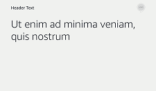

[TOC]

此文档仅针对SDK 返回的语义服务json的`data`、`tips`、`speak_tips`、`noscreen_answer`、`answer`字段，适用于采用V3服务协议的终端。
### 1 协议规范

#### 1.1 基本原则

- 仅关注资源类型，力图与终端UI解耦
- 提供有限的UI格式指示

#### 1.2 下发`data`字段数据的Overview

##### 1.2.1 Overview

```json
{
  "controlInfo":{
    "version":"1.0.0",
    "type":"someType",					// 模版类型 文本，图文 等
    "textSpeak":"true",					// 基础元组 中数据是否需要播报 默认播报 (false 不播报 true 播报)
    "audioConsole":"true",				// 基础元组 中音频数据是否显示控制台，默认显示 (false 不显示 true 显示)
    "orientation":"portrait"            // 列表样式 默认竖向 横向（landscape）/竖向（portrait）
  },
  "baseInfo":{
    "skillName":"DemoSkill",			// 技能名称
    "skillIcon":"DemoSkillIcon",		// 技能图标
  },
  "globalInfo":{
    "backgroundImage":Image,			// Image对象，用于存放背景图信息
    "backgroundAudio":Audio,			// Audio对象，用于存放背景音信息
    "seeMore":"https://dd.qq.com",      // 查看更多
    "selfData":{}
  },
  "listItems":[
    {},
    {},
    ...,
    {}
  ],
  "serverInfo":{
    "ret": "302",
    "msg": "重定向原因说明",
    "hostDomain": "当前领域",
    "hostIntent": "当前意图",
    "locDomain": "目标领域",
    "locIntent": "目标意图"
  },
  "uriInfo":{
    "ui":{
        "url":"https://xxxx/0000001201806051653111406280810A"
    }
  }
}
```

##### 1.2.2 Overview规范说明
- `controlInfo` 对象，存放UI展示的控制信息，例如纯文本、图文等，$\textcolor{Red}{字段不允许随意扩展} $

    ​ `version` string，标识回复结构版本号 默认为“1.0.0”
    ​ `type` 字段，建议终端需要使用哪种卡片类型

  | Property | Description     |
  | -------- | --------------- |
  | TEXT     | 纯文本             |
  | GRAPHIC  | 图文类             |
  | AUDIO    | 音频类             |
  | VIDEO    | 视频类             |
  | URI      | 统一资源类 用于支付、登录场景 |

    ​ `textSpeak` 字段， string 类型，用于指示 基础元组 中的文本是否播报

    ​ `audioConsole` 字段，string类型，用于指示 基础元组 中的音频是否显示控制台

    ​ `orientation` 字段，string类型，用于指示 基础元组 数组的排列方向 横向/竖向

  | Property  | Description |
  | --------- | ----------- |
  | landscape | 横向          |
  | portrait  | 竖向          |

    *PS: 即使只有回复语，也需要下发该部分json数据*

- `baseInfo` 对象，存放本次问答基本信息，例如技能名称、技能图标，$\textcolor{Red}{字段不允许随意扩展} $

- `globalInfo` 对象，存放下发内容中的全局元素，例如背景图片、查看更多等，$\textcolor{Red}{字段不允许随意扩展} $


- `listItems` 数组，元素由`基本元组`填充，解释见下节
- `uriInfo` 对象，存放支付、登录等资源 url，当前阶段仅存在 UI 信息

#### 1.3 基本元组

##### 1.3.1 基本元组

```json
{
    "title":"DemoTitle",								// 标题，默认呈现和播报
    "textContent":"DemoTextContent",					// 内容，默认呈现和播报
    "image":{
        "contentDescription": "I'm picture's description...",
        "sources":[
            {
                "url":"https://dingdang.qq.com/image1.png",
                "size":"SMALL",							// X_SMALL/SMALL/MEDIUM/LARGE/X_LARGE
                "widthPixels": 720,
                "heightPixels": 480
            },
        ]
    },												    // 图片资源
    "audio":{
        "stream":{
            "url":"https://dingdang.qq.com/audio1.mp3",
        },
        "metadata":{
            "offsetInMilliseconds": 0,					// 播放偏移时间
            "totalMilliseconds": 1000					// 播放总时长	
        }		
    },  												// 音频资源
    "video":{
        "sources":[
            {
                "url":"https://dingdang.qq.com/video1.mp4",
                "size":"NORMAL"
            },
    	],
    	"metadata":{
            "offsetInMilliseconds": 0,					// 播放偏移时间
            "totalMilliseconds": 1000					// 播放总时长	
    	}
    },												    // 视频资源
    "htmlView":"https://dingdang.qq.com",				// 落地页/跳转链接
    "mediaId":"media_12345",							// 内容ID，该条资源的唯一ID，上报使用
    "selfData":{}
}
```

##### 1.3.2 基本元组规范说明

- Text 文本字段，这里向AVS靠齐，设计二个字段承载文本内容，但不控制字体属性

  ​	`title` string 填充标题

  ​	`textContent` string 填充内容

  ***[图例3.3.2.1]***

   

- Image 图片字段，这里借鉴AVS的协议格式吗，内嵌 `sources` 数组，以支持多大小图片数据的下发

  ​	`contentDescription` 图片的文本描述，当图片未加载完成时，显示该文本

  ​ `sources.url` 图片资源URL

  ​	`sources.size` 标明图片尺寸类别，复刻AVS对图片大小的分类 

  | Property | Description                             | Recommended Size (in pixels)Width x Height |
  | -------- | --------------------------------------- | ---------------------------------------- |
  | X_SMALL  | Displayed within extra small containers | 480 * 320                                |
  | SMALL    | Displayed within small containers       | 720 * 480                                |
  | MEDIUM   | Displayed within medium containers      | 960 * 640                                |
  | LARGE    | Displayed within large containers       | 1200 * 800                               |
  | X_LARGE  | Displayed within extra large containers | 1920 * 1280                              |

  ​	`sources.widthPixels` 图片宽度 可选

  ​	`sources.heightPixels` 图片高度 可选

- Audio 音频字段，存放音频链接

  ​	`stream.url` 存放音频链接

  ​	`metadata.offsetInMilliseconds` 播放偏移量

  ​	`metadata.totalMilliseconds` 资源总时长


- Video 视频字段，存放视频连接，与 `image` 字段风格保持一致

  ​	`sourcesu.url` 视频资源URL

  ​	`sourcess.size` 视频资源品质

  | Property  | Description |
  | --------- | ----------- |
  | FLUENCY   | 流畅（270P）    |
  | SD        | 标清（480P）    |
  | HD        | 高清（720P）    |
  | BLUELIGHT | 蓝光（1080P）   |


  ​	`metadata.offsetInMilliseconds` 播放偏移量

  ​	`metadata.totalMilliseconds` 资源总时长	

- HtmlView 借鉴DureOS命名，用于承载跳转链接、落地页等页面

- MediaId 本Cell内资源的唯一ID，用于定位资源、上报等渠道

- SelfData 上述字段仍不能满足领域诉求的，可使用该对象进行扩充

### 2 More

#### 2.1 回复语字段使用规范

- tips	// 用于呈现的提示语，默认呈现
- speak_tips // 用于播报的提示语，默认播报
  - noscreen_answer //弃用	
- answer // 弃用

#### 2.2 文本字段用途总述

##### 2.2.1 回复语

| Property   | Description |
| ---------- | ----------- |
| tips       | 默认呈现        |
| speak_tips | 默认播报        |

##### 2.2.2 基本元组

| Property                           | Description      |
| ---------------------------------- | ---------------- |
| listItems.title                    | 默认播报与呈现          |
| listItems.textContent              | 默认播报与呈现          |
| listItems.image.contentDescription | 当图片加载失败/未加载完成时呈现 |

##### 2.2.3 播报语

若controlInfo.textSpeak为true，终端需要将speak_tips、listItems.title（若有） 、listItems.textContent连起来播报（若有）。 否则，只需要播放speak_tips。

#### 3 各个领域返回V3数据示例

见：
https://github.com/TencentDingdang/tvs-tools/tree/master/doc/domains_V3